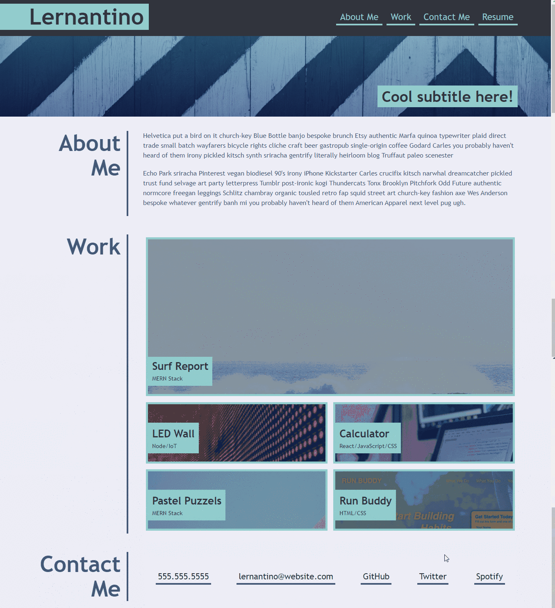

# MyPortfolio

## Purpose
This site is part of 2.week challange.

## Build with:
 - HTML
 - Advance CSS

## Description
This is second homework and task was to create web site from scratch!

## Project challanges
* Buil site based on Mock-UP
* Use the Acceptance Criteria as a guide for how you'll plan deadlines, sketch, and code your portfolio.
* Ensure that your work meets the Acceptance Criteria and the full list of grading requirements.

## Project screen shots

## Website link
https://lakicode.github.io/MyPortfolio/

## web site developer
Made by Robert Fuke